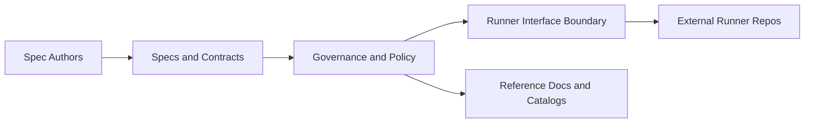

# Chapter 05: What Is Data Contracts

```yaml doc-meta
doc_id: DOC-REF-105
title: Chapter 05 What Is Data Contracts
status: active
audience: author
owns_tokens:
- spec_purpose_foundation
requires_tokens:
- normative_reference_map
commands:
- run: ./runners/public/runner_adapter.sh --impl rust governance
  purpose: Confirm contracts and governance surfaces are valid.
examples:
- id: EX-WHAT-IS-001
  runnable: true
sections_required:
- '## Purpose'
- '## Inputs'
- '## Outputs'
- '## Failure Modes'
```

## Purpose

Explain what this repository is, what the spec controls, and why a contract-first system exists.

## Inputs

- `/specs/schema/schema_v1.md`
- `/specs/contract/index.md`
- `/specs/governance/index.md`

## Outputs

- clear mental model of spec vs implementation boundaries
- clear reason to trust contract-backed policy over ad-hoc docs

## Failure Modes

- treating narrative docs as normative source of truth
- conflating runner implementations with spec ownership
- changing behavior without contract/schema/policy updates

## System Intent

`data-contracts` is the canonical specification and governance control plane for executable contract specs.
Implementations consume this spec; they do not redefine it.

## High-Level Architecture



Interpretation:
- Specs and contracts are canonical behavior definitions.
- Governance enforces consistency and quality.
- Runners execute through a stable interface boundary.
- Implementation repos consume, not own, canonical contracts.

## Why This Exists

- Preserve semantics across multiple implementations.
- Keep behavioral changes explicit and reviewable.
- Ensure docs, schema, policy, and checks stay synchronized.
