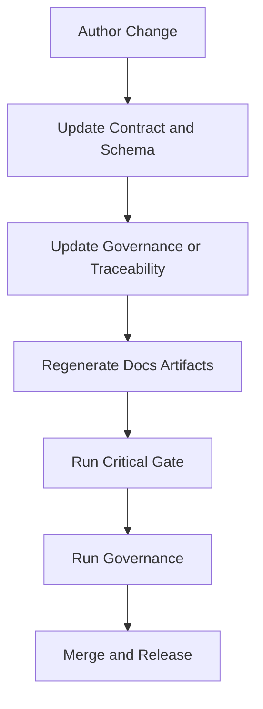
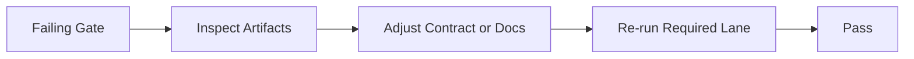

# Chapter 15: Spec Lifecycle

```yaml doc-meta
doc_id: DOC-REF-115
title: Chapter 15 Spec Lifecycle
status: active
audience: maintainer
owns_tokens:
- spec_lifecycle_flow
requires_tokens:
- spec_purpose_foundation
commands:
- run: ./scripts/control_plane.sh critical-gate
  purpose: Run lifecycle-critical checks before merge.
examples:
- id: EX-SPEC-LIFECYCLE-001
  runnable: true
sections_required:
- '## Purpose'
- '## Inputs'
- '## Outputs'
- '## Failure Modes'
```

## Purpose

Describe how a spec change moves from authoring to enforced behavior and stable documentation.

## Inputs

- changed files under `/specs` and `/docs`
- required lane commands and governance checks

## Outputs

- deterministic pass/fail status for proposed change
- synchronized contract/schema/docs artifacts

## Failure Modes

- contract update without traceability/policy updates
- docs updates without generated surface refresh
- governance drift hidden by partial local checks

## Lifecycle Flow



Interpretation:
- The lifecycle is contract-led, not implementation-led.
- Doc generation is part of validation, not optional cleanup.
- Governance is the final coherence check across surfaces.

## Feedback Loop



Interpretation:
- Failures should route back to contract/doc fixes.
- Artifact outputs are the first debugging surface.
