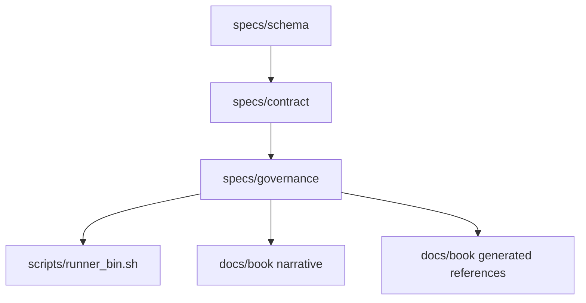
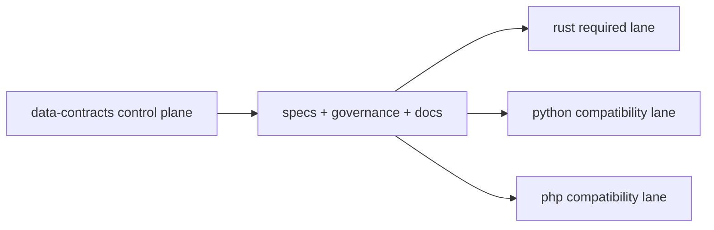

# Chapter 25: System Topology

```yaml doc-meta
doc_id: DOC-REF-125
title: Chapter 25 System Topology
status: active
audience: reviewer
owns_tokens:
- system_topology_view
requires_tokens:
- spec_lifecycle_flow
commands:
- run: ./scripts/control_plane.sh governance
  purpose: Validate topology-linked docs and policy expectations.
examples:
- id: EX-TOPOLOGY-001
  runnable: true
sections_required:
- '## Purpose'
- '## Inputs'
- '## Outputs'
- '## Failure Modes'
```

## Purpose

Show the canonical topology of specification surfaces, governance, docs, and runner boundaries.

## Inputs

- `/specs/index.md`
- `/specs/contract/index.md`
- `/specs/schema/index.md`
- `/docs/book/index.md`

## Outputs

- shared model of repository structure and ownership boundaries

## Failure Modes

- storing implementation internals in spec control-plane
- missing linkage between normative and generated surfaces
- assuming CI topology from non-canonical docs

## Component Topology



Interpretation:
- Schema and contract are upstream of governance.
- Governance and runner boundary enforce executable behavior.
- Narrative docs and generated references are separate but synchronized surfaces.

## Ownership Topology



Interpretation:
- This repo owns canonical spec behavior.
- Runner repos own implementations.
- Lane classes are policy-managed from this control plane.
