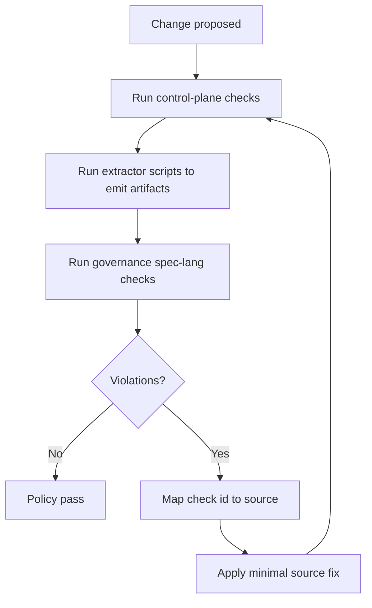

# Chapter 70: Governance And Quality

```yaml doc-meta
doc_id: DOC-REF-170
title: Chapter 70 Governance And Quality
status: active
audience: maintainer
owns_tokens:
- governance_control_plane_quality
requires_tokens:
- spec_lifecycle_flow
commands:
- run: ./scripts/ci_gate.sh
  purpose: Execute control-plane governance and docs integrity checks.
examples:
- id: EX-GOV-QUALITY-001
  runnable: true
sections_required:
- '## Purpose'
- '## Inputs'
- '## Outputs'
- '## Failure Modes'
```

## Purpose

Describe policy enforcement for control-plane coherence across specs, contracts, schema, docs, and status-ingest artifacts.

## Inputs

- governance cases in `specs/04_governance/cases/core`
- contract/policy/traceability surfaces

## Outputs

- deterministic integrity verdicts for control-plane changes
- traceable failure IDs and remediation paths
- policy verdicts sourced from executable spec-lang assertions, with shell as extractor/orchestrator only

## Failure Modes

- docs and contracts drifting apart
- stale/missing compatibility telemetry not surfaced
- runtime implementation assumptions leaking into control-plane policies

## Governance Decision Path


