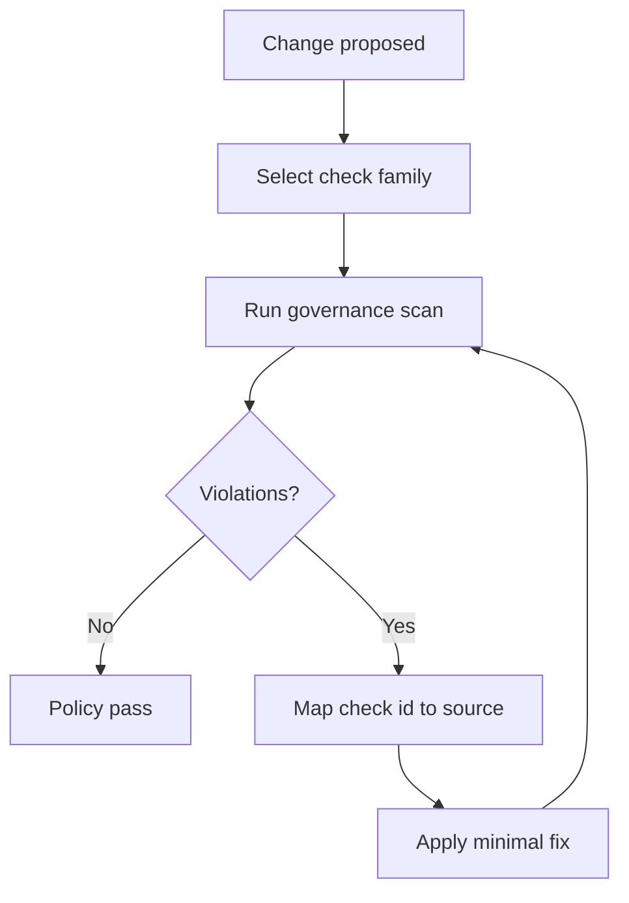

# Chapter 70: Governance And Quality

```yaml doc-meta
doc_id: DOC-REF-170
title: Chapter 70 Governance And Quality
status: active
audience: maintainer
owns_tokens:
- governance_triage_workflow
requires_tokens:
- spec_lifecycle_flow
commands:
- run: ./runners/public/runner_adapter.sh --impl rust governance
  purpose: Execute governance checks and policy scans.
- run: ./runners/public/runner_adapter.sh --impl rust docs-generate-check
  purpose: Ensure generated docs surfaces are synchronized.
examples:
- id: EX-GOV-QUALITY-001
  runnable: true
sections_required:
- '## Purpose'
- '## Inputs'
- '## Outputs'
- '## Failure Modes'
```

## Purpose

Describe governance enforcement and quality gates for schema/docs/runtime consistency.

## Inputs

- governance cases in `specs/governance/cases/core`
- contract policy and check maps

## Outputs

- deterministic policy enforcement
- traceable check IDs and remediation paths

## Failure Modes

- drift between docs, schema, and runtime behavior
- missing generated artifacts
- stale or misordered reference manifest entries

## Governance Decision Path



Interpretation:
- Governance checks are executable contract checks, not prose policy.
- Check IDs are the stable remediation anchor.
- Fixes should target source-of-truth files, then re-run scan.

## Quality Gates

- spec-lang lint/format checks
- docs generation/check synchronization
- governance prefix and broad scans
- CI summary contract output
