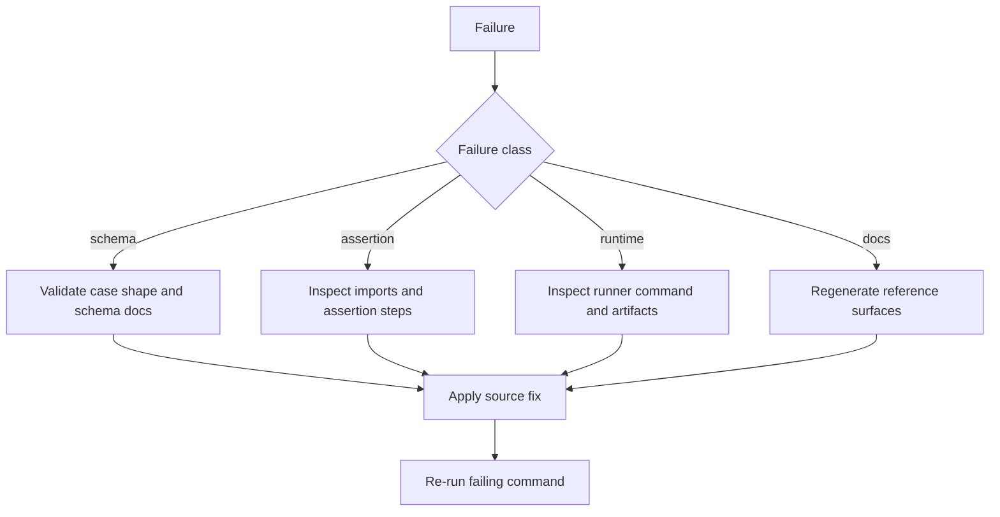

# Chapter 80: Troubleshooting

```yaml doc-meta
doc_id: DOC-REF-180
title: Chapter 80 Troubleshooting
status: active
audience: maintainer
owns_tokens:
- deterministic_failure_triage
requires_tokens:
- governance_triage_workflow
commands:
- run: ./scripts/local_ci_parity.sh
  purpose: Reproduce critical gate failures with local parity flow.
- run: ./runners/public/runner_adapter.sh --impl rust governance --check-prefix docs
  purpose: Isolate docs/governance failures.
examples:
- id: EX-TROUBLESHOOT-001
  runnable: true
sections_required:
- '## Purpose'
- '## Inputs'
- '## Outputs'
- '## Failure Modes'
```

## Purpose

Provide deterministic troubleshooting flow for schema, assertion, runtime, and docs failures.

## Inputs

- failing check ID or command
- local artifact outputs under `.artifacts/`

## Outputs

- root-cause isolation
- repeatable remediation sequence

## Failure Modes

- symptom-only debugging without check context
- fixing generated outputs without fixing source-of-truth inputs
- partial reruns that miss dependent checks

## Troubleshooting Decision Tree



Interpretation:
- classify the failure before changing files.
- always fix source inputs before generated outputs.
- re-run the failing command first, then full required sequence.

## Failure Taxonomy

- `schema`: invalid case/shape/field semantics
- `assertion`: expected contract condition failed
- `runtime`: command/helper execution failure
- `docs`: manifest/reference synchronization failure

## Deterministic Recovery Flow

1. Re-run failing command in Rust lane.
2. Identify check ID from summary output.
3. Run targeted governance prefix or surface command.
4. Fix source-of-truth files.
5. Re-run format/lint/tests and parity gate.

## Escalation

Escalate when failures are non-deterministic across repeated runs or imply runtime contract regression across lanes.
