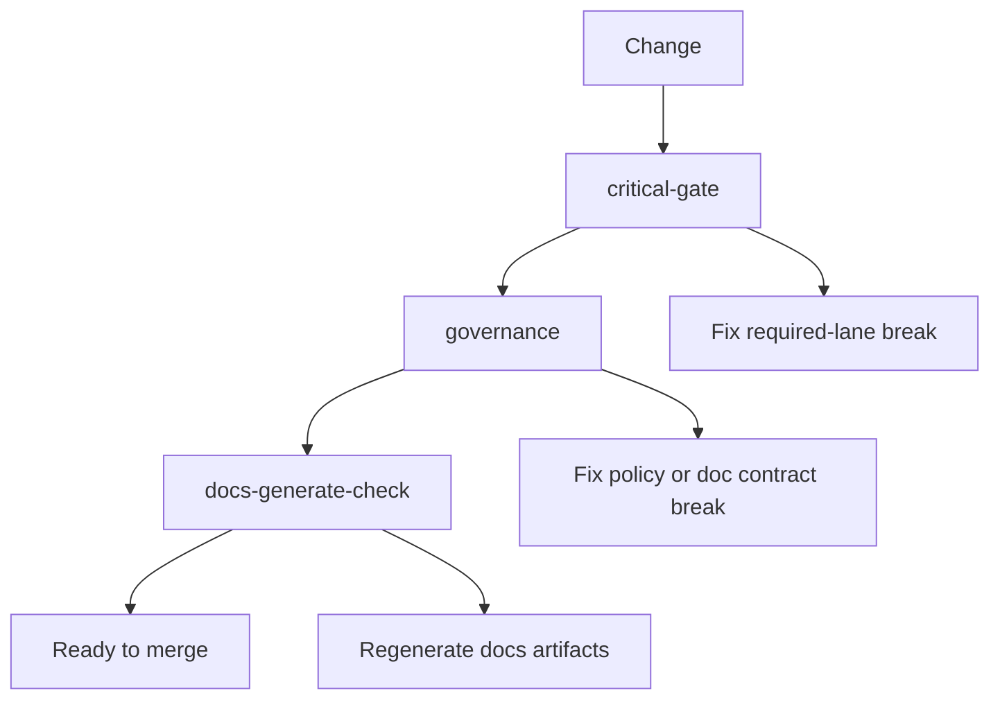

# Guide 03: Running Checks and Gates

```yaml doc-meta
doc_id: DOC-GUIDE-203
title: Guide 03 Running Checks and Gates
status: active
audience: maintainer
owns_tokens:
- guide_running_checks_and_gates
requires_tokens:
- guide_first_spec_authoring
commands:
- run: ./scripts/control_plane.sh critical-gate
  purpose: Run required blocking checks.
- run: ./scripts/control_plane.sh governance
  purpose: Validate policy and docs contracts.
- run: ./scripts/control_plane.sh docs-generate-check
  purpose: Verify generated docs freshness.
examples:
- id: EX-GUIDE-03-001
  runnable: true
sections_required:
- '## Purpose'
- '## Inputs'
- '## Outputs'
- '## Failure Modes'
```

## Purpose

Run the required gate sequence and interpret outcomes deterministically.

## Inputs

- modified spec/docs files
- required lane adapter command

## Outputs

- pass/fail decision for merge-readiness
- artifacts for diagnosing failures

## Failure Modes

- running checks out of order and missing root cause
- treating compatibility telemetry as required-lane blocker
- ignoring docs freshness failures

## Gate Execution Flow



Interpretation:
- `critical-gate` is first because it protects required-lane behavior.
- `governance` enforces cross-surface contract coherence.
- `docs-generate-check` ensures generated references are fresh.
- Fixes should target the first failing step before re-running all checks.

## Do This Now

```bash
./scripts/control_plane.sh critical-gate
./scripts/control_plane.sh governance
./scripts/control_plane.sh docs-generate-check
```

## How To Verify Success

- [ ] all three commands exit 0
- [ ] no stale generated doc artifacts
- [ ] no unresolved governance violations

## Common Failure Signatures

| Signature | Likely Cause | Action |
| --- | --- | --- |
| `critical-gate` failed | required-lane contract/schema break | fix failing contract/case first |
| `governance` violation_count > 0 | docs/policy mismatch | inspect check id and align source files |
| `docs-generate-check` drift | generated refs stale | run docs generation build and commit updates |
