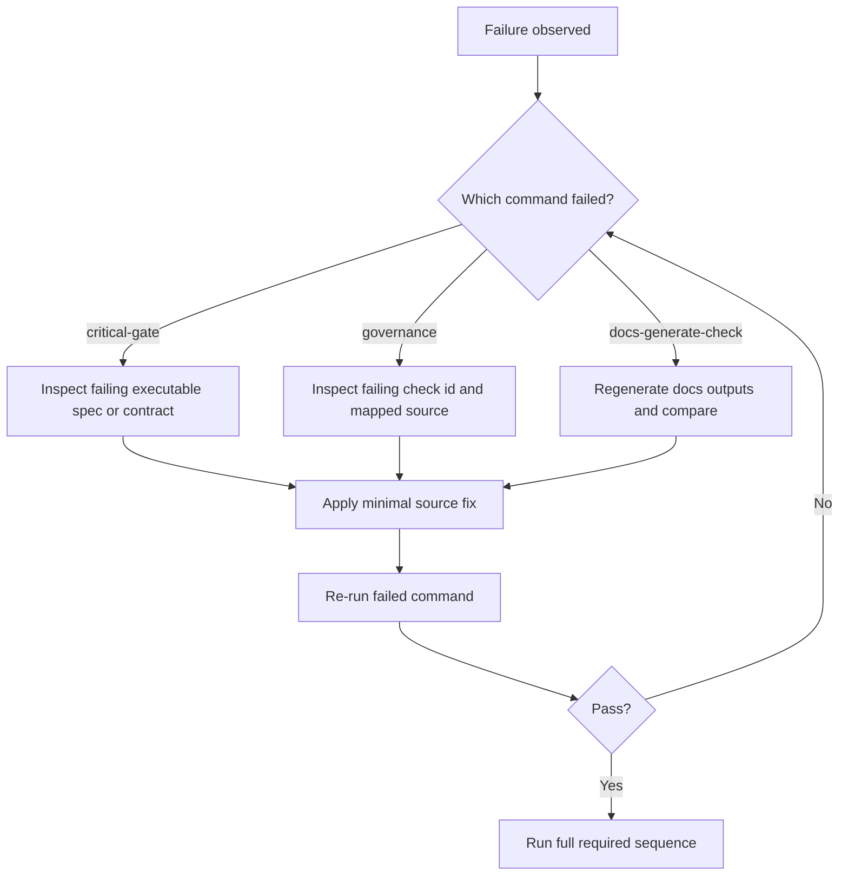

# Guide 04: Debugging Failures

```yaml doc-meta
doc_id: DOC-GUIDE-204
title: Guide 04 Debugging Failures
status: active
audience: maintainer
owns_tokens:
- guide_debugging_failures
requires_tokens:
- guide_running_checks_and_gates
commands:
- run: ./scripts/control_plane.sh governance
  purpose: Reproduce and isolate governance violations.
examples:
- id: EX-GUIDE-04-001
  runnable: true
sections_required:
- '## Purpose'
- '## Inputs'
- '## Outputs'
- '## Failure Modes'
```

## Purpose

Provide a reliable triage path from failure signal to focused fix.

## Inputs

- failing command output
- related contract/schema/doc file paths

## Outputs

- identified root cause
- minimal corrective diff

## Failure Modes

- fixing symptoms in generated files only
- patching multiple surfaces without identifying first failing check
- skipping targeted re-runs after fix

## Troubleshooting Decision Tree



Interpretation:
- Debug from command class first, not from file guesswork.
- Generated docs should be regenerated, not hand-edited in generated sections.
- Keep fixes minimal and re-run the exact failing command before full run.

## Do This Now

```bash
./scripts/control_plane.sh governance
rg -n "DCGOV|violation|failed" .artifacts -g '*.json' -g '*.md'
```

## How To Verify Success

- [ ] failing check id no longer appears
- [ ] targeted command exits 0
- [ ] full required sequence is green

## Common Failure Signatures

| Signature | Likely Cause | Action |
| --- | --- | --- |
| check id unresolved | typo or stale governance case mapping | align case id and referenced check id |
| reference manifest mismatch | manifest/chapter list drift | update manifest and regenerate reference index |
| token dependency unresolved | missing `owns_tokens` or absent token text | add owner token and include token text in owner doc |
