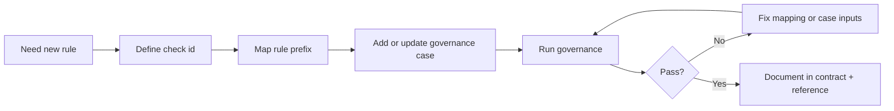

# Guide 06: Governance Tuning

```yaml doc-meta
doc_id: DOC-GUIDE-206
title: Guide 06 Governance Tuning
status: active
audience: maintainer
owns_tokens:
- guide_governance_tuning
requires_tokens:
- guide_release_change_control
commands:
- run: ./scripts/control_plane.sh governance
  purpose: Validate governance check changes.
examples:
- id: EX-GUIDE-06-001
  runnable: true
sections_required:
- '## Purpose'
- '## Inputs'
- '## Outputs'
- '## Failure Modes'
```

## Purpose

Change governance behavior safely while preserving check traceability.

## Inputs

- proposed rule/check id changes
- updated case specs under `specs/04_governance/cases/core`

## Outputs

- coherent rule-to-check mapping
- passing governance suite after tuning

## Failure Modes

- check id added without case coverage
- case updates without prefix map alignment
- relaxing strict checks without contract rationale

## Governance Decision Path



Interpretation:
- Keep one stable check id per behavior.
- Rule mapping and executable case must change together.
- Governance pass is required before documenting new policy as canonical.

## Do This Now

```bash
./scripts/control_plane.sh governance
rg -n "DCGOV-|docs\." specs/04_governance/check_prefix_map_v1.yaml specs/04_governance/cases/core -g '*.yaml' -g '*.md'
```

## How To Verify Success

- [ ] every new rule id maps to a valid check id
- [ ] every new check id has an executable governance case
- [ ] governance exits 0

## Common Failure Signatures

| Signature | Likely Cause | Action |
| --- | --- | --- |
| unknown check id | case references non-existent check | correct `harness.check.config.check` |
| unmapped DCGOV id | missing prefix-map entry | add rule mapping in `check_prefix_map_v1.yaml` |
| policy/reference drift | docs not updated for new checks | update chapter 90 and generated check reference |
