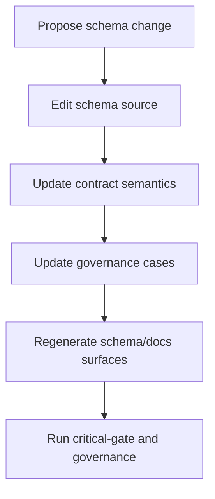

# Guide 07: Schema Extension Workflow

```yaml doc-meta
doc_id: DOC-GUIDE-207
title: Guide 07 Schema Extension Workflow
status: active
audience: maintainer
owns_tokens:
- guide_schema_extension_workflow
requires_tokens:
- guide_first_spec_authoring
commands:
- run: ./scripts/control_plane.sh critical-gate
  purpose: Validate schema extension changes against required lane.
examples:
- id: EX-GUIDE-07-001
  runnable: true
sections_required:
- '## Purpose'
- '## Inputs'
- '## Outputs'
- '## Failure Modes'
```

## Purpose

Extend schema and contract surfaces without breaking existing executable specs.

## Inputs

- target schema under `specs/01_schema/`
- related contract docs under `specs/02_contracts/`

## Outputs

- schema/contract updates with matching docs references
- passing schema and governance checks

## Failure Modes

- schema updates without contract explanation
- contract updates without downstream doc sync
- adding optional fields without traceability impact analysis

## Schema Evolution Flow



Interpretation:
- Schema change is not complete until contract and governance are aligned.
- Generated schema docs are part of acceptance, not a post-step.
- Regressions should be caught in required-lane checks.

## Do This Now

```bash
./scripts/docs_generate_all.py --build
./scripts/control_plane.sh critical-gate
./scripts/control_plane.sh governance
```

## How To Verify Success

- [ ] schema docs regenerate cleanly
- [ ] no schema-contract sync violations
- [ ] required lane checks pass

## Common Failure Signatures

| Signature | Likely Cause | Action |
| --- | --- | --- |
| schema registry sync violation | registry/docs mismatch | rebuild generated schema docs and update source |
| contract import assertion failures | contract semantics stale | align contract examples with new field behavior |
| governance case break after schema edit | case assumptions outdated | update impacted governance cases |
