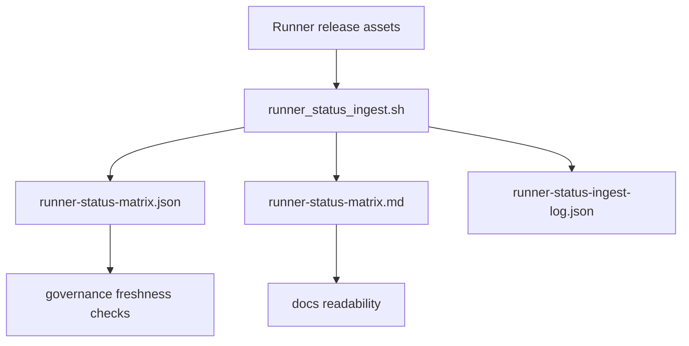

# Guide 09: Status Exchange Operations

```yaml doc-meta
doc_id: DOC-GUIDE-209
title: Guide 09 Status Exchange Operations
status: active
audience: maintainer
owns_tokens:
- guide_status_exchange_operations
requires_tokens:
- usage_guides_entrypoint
commands:
- run: ./scripts/runner_status_ingest.sh --max-age-hours 72 --enforce-freshness
  purpose: Validate compatibility telemetry ingestion and freshness policy.
examples:
- id: EX-GUIDE-09-001
  runnable: true
sections_required:
- '## Purpose'
- '## Inputs'
- '## Outputs'
- '## Failure Modes'
```

## Purpose

Operate the runner status exchange and interpret compatibility matrix freshness semantics.

## Inputs

- `specs/01_schema/runner_status_report_v1.yaml`
- `specs/01_schema/runner_status_matrix_v1.yaml`
- `specs/01_schema/runner_certification_registry_v1.yaml`
- `scripts/runner_status_ingest.sh`

## Outputs

- refreshed matrix artifacts
- actionable stale/missing compatibility status signals

## Failure Modes

- stale telemetry beyond 72h SLO
- missing release assets for a compatibility lane
- checksum mismatch for status artifacts

## Status Exchange Flow



Interpretation:
- source of truth is release-asset status payloads from runner repos.
- ingestion always emits matrix/log artifacts, even with partial failure.
- stale/missing compatibility signals breach freshness policy.

## Do This Now

```bash
./scripts/runner_status_ingest.sh --max-age-hours 72 --enforce-freshness
cat .artifacts/runner-status-matrix.md
```

## How To Verify Success

- [ ] matrix JSON/MD artifacts are emitted
- [ ] ingest log captures missing/stale lanes explicitly
- [ ] required lane policy effects are blocking when failed

## Common Failure Signatures

| Signature | Likely Cause | Action |
| --- | --- | --- |
| `freshness_state: stale` | report older than 72h | trigger new runner release report and re-ingest |
| `freshness_state: missing` | no report asset found | verify registry template and release asset naming |
| checksum validation error | artifact tampering or mismatch | re-publish report asset with correct checksum |
